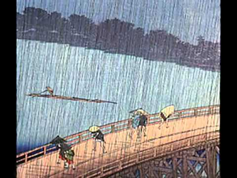

武満徹の雨の樹素描
==================

The reason I've set up this public repository is four-fold:
 * As a prominent Japanese musician of the late century, Toru Takemitsu is although not widely known out of Japan contemporary music circles. I'd thus like to contribute in a very humble way to pay tribute to him.
 * Music engraving has evolved in a rather impressive fashion because of software but most of scores are still printed of papers, not distributed as digital documents. Moreover, most of digital score are under restrictive license. I will release this score on Mutopia when it will be fine enough.
 * Basically, Lilypond is an awesome software with endless possibilities thanks to Lisp-based music-specific language. It's a great opportunity for an in-depth understanding of Lilypond to let it face up contemporary music which uses very peculiar « glyph grammar ».
 * Finally, in a personnal way, this piece will be part of my graduation performance. I've bought an original score but I'd rather prefer music I play to keep being free :-)

Lilypond code questions
=======================

* This piece makes innovative use of all three pedals of the piano. I've tried to play a bit with [this snippet](http://lilypond.org/doc/v2.19/Documentation/snippets/keyboards#keyboards-changing-the-text-for-sustain-markings) but I'm not convinced by what I've got. I especially don't know how to symbolize half pedal to the best of my knowledge. Moreover, I'd like to change « simile » for an arrow →.
* How to show some notes of a chord are played with the left hand and some others are played with the right one? The score notation is clear.
* What is the best way to get bar numbers in an unmetered music score? I feel the way I've done it is just an expedient.

Help and contribution are the most welcomed!
============================================

Please just feel free to issue a pull request or send me a message. I will review any help with great consideration. First of all: thank you for reading this and being willing to help :-)

About Toru Takemitsu
====================

One of the most influential Japanese composers in the late twentieth century, Toru Takemitsu (1930-96) created a unique musical language by integrating the disparate musical traditions of East and West. This lecture/recital will investigate the metaphor behind Takemitsu's last two solo piano pieces, Rain Tree Sketch (1982) and Rain Tree Sketch II (1992). The lecture explores the interaction of ideas between Takemitsu and his novelist friend Kenzaburo Oe, the Nobel Prize winning author whom inspired Takemitsu to compose the Rain Tree series. An analytic overview of the piano pieces will also be given which indicates the influence of Olivier Messiaen. A performance of the complete Rain Tree Sketcheswill follow the lecture.

The origin of the Rain Tree Sketches can be traced back to Takemitsu's percussion trio Rain Tree (1981), which was based on a description of a rain-tree in Kenzaburo Oe's short novel "Clever Rain Tree" (1980). Rain Tree is used as a metaphor of water circulating in the cosmos, and Takemitsu employed Messiaen's modes of limited transposition in order to construct the pitch collections evocative of cosmic imagery. Takemitsu's goal as an artist was to expand the possibilities of music, and to express himself through creation of a universal language. This lecture/recital will demonstrate how this goal is realized in the Rain Tree Sketches.

— Tomoko Isshiki, University of Houston, The Cosmic Metaphor of Toru Takemitsu's "Rain Tree Sketches"

About Licensing and Copyright Concerns
======================================

I sure don't want to infringe any copyright. I hereby merely share `*.ly` files within this repository. This file is source code. I chose to share it with anyone. It can be compiled to a `*.pdf` file which is public property according to the free license I've chosen.
